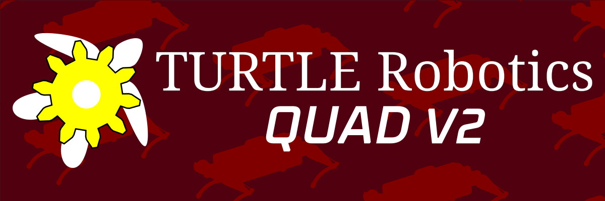

[](https://github.com/turtle-robotics)

Source code for the second revision of TURTLE's quadruped project (QUAD).

# Dependencies
Build requires CMake and the following packages:
 - Debian/Ubuntu `apt install eigen3`
 - Arch: `pacman -S eigen`

# Build
## Generate Buildsystem (once on setup)
```sh
cmake -B build --fresh --preset rpi
```

> [!NOTE]
> There are multiple presets. Use preset `rpi` for building for the Raspberry Pi and `local` for building/testing locally

## Build the Project
To build:
```sh
make -C build
```

To build & deploy to the robot:
```sh
make -C build deploy
```